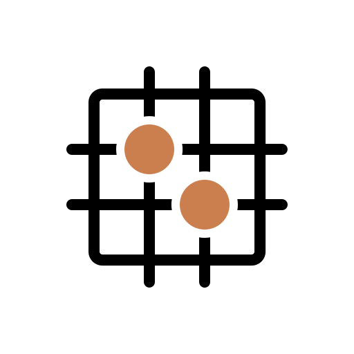

<h1 align="center"> GoGoGo</h1>

  
  
  

----------------------------------------------------------------------

# Projet GoGoGo - Plateforme en ligne pour les passionnés de Go

L'association EtiGO, ayant rassemblé pendant plusieurs années les joueurs de Go de Dijon et de ses environs, se lance dans une initiative novatrice pour étendre son influence. Nous sommes fiers de présenter notre projet de développement d'une application web dédiée, offrant une plateforme moderne et conviviale destinée à nos membres existants et à de nouveaux joueurs.

## Objectif du Projet

L'application vise à faciliter les rencontres en ligne entre les passionnés de Go, offrant la possibilité de jouer des parties avec classement et de participer à des tournois virtuels. Notre vision est de rendre le monde fascinant du Go accessible à la jeune génération grâce à une interface intelligente et moderne, tout en préservant l'expérience des joueurs plus traditionnels moins habitués au monde du web et du numérique.

### Fonctionnalités Principales

**Parties en Ligne avec Classement :** Jouez contre d'autres membres et suivez votre progression à travers un système de classement en temps réel.

**Organisation de Tournois :** Participez à des tournois en ligne pour tester vos compétences et rencontrer d'autres passionnés de Go.

**Interface Intuitive :** Une conception conviviale adaptée à la fois aux adeptes du numérique et à ceux qui sont moins familiers avec les technologies web.

**Accessibilité Inter-Générationnelle :** Nous nous engageons à offrir une expérience sans barrières, permettant à la jeune génération de s'intégrer facilement tout en préservant l'inclusion des joueurs moins habitués au numérique.

## Installation et Guide Utilisateur
Ces documents sont disponibles dans le dossier `docs/` du projet et contiennent les instructions pour installer et utiliser l'application.

## Contributeurs

***REMOVED*** ***REMOVED*** (***REMOVED***Gdr), ***REMOVED*** ***REMOVED*** (HuGo***REMOVED***), ***REMOVED*** ***REMOVED*** (***REMOVED******REMOVED***), ***REMOVED*** ***REMOVED*** (Synel)

Tous les contributeurs sont liés à une adresse IUT, sont identifiés explicitement ci-dessus, et sont donc identifiables par les administrateurs du projet.

**Dans la logique établie avec Mme ***REMOVED*** lors des retours de l'alpha par la promo entière, aucun retrait de points sur les pseudos n'est censé être effectué pour ce projet, que ce soit pour un membre ou pour l'équipe entière.**

[//]: contributor-faces

         

[//]: contributor-faces
